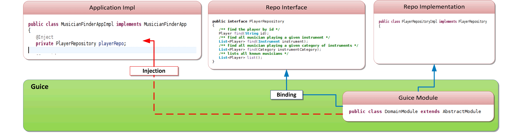
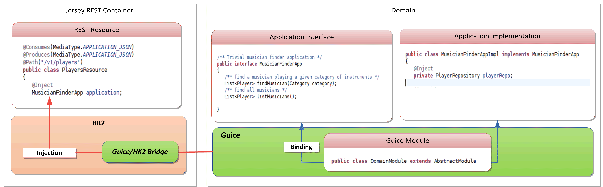
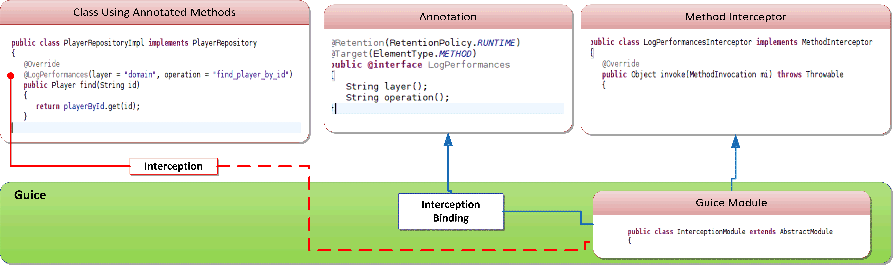
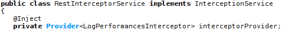
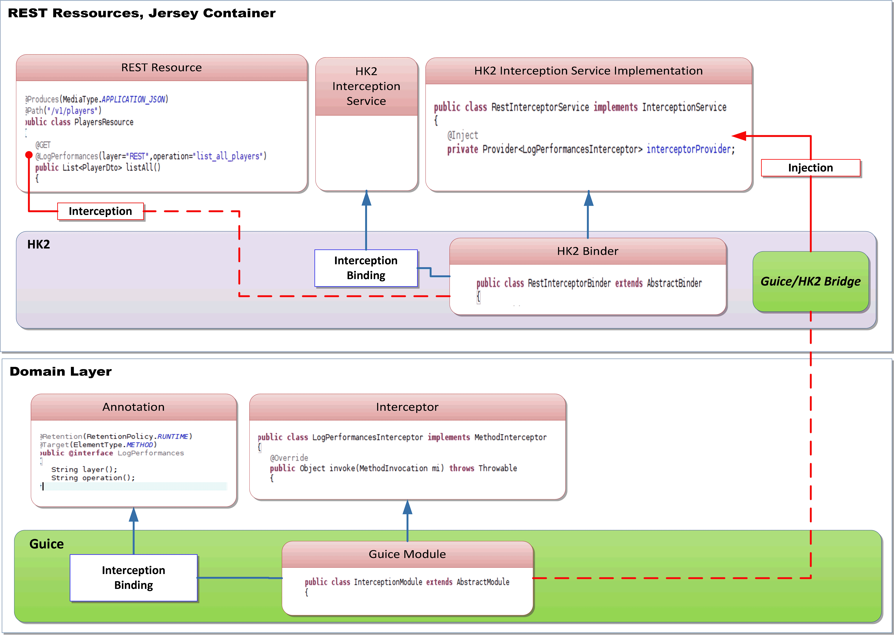

# Working with Jersey and Guice
( DI and AOP using Guice, HK2 and HK2/Guice Bridge )

## Motivation 

Our Domain code really likes Guice IOC, and we feel really comfortable with it.
Our REST exposition really likes Jersey, and we also feel really comfortable with. 

We naturally wanted to expose our Domain code via Jersey REST resources. 

The main point is that Jersey uses Glassfish's injection framework called HK2, and our need was to re-use DI and AOP features we already implemented with Guice.

Now one of the really really cool features of HK2 is to propose injector bridges ! So there is one for Spring and another for Guice, allowing to mix the frameworks and annotations in order to achieve a smooth integration.

In this sample project we’ll show how to use Guice, HK2 and HK2 Guice/Brige in order to integrate both AOP and DI Guice features in the Jersey REST resources.

## Jersey/HK2 Versions

HK2/Jersey AOP support is quite “fresh”. In order to use it, you’ll need at least : 

* Jersey v 2.6 
* HK2    v 2.3.0-b01.

## Example DI/AOP Features

The sample show how to deal with basic Injection and Interception on both Domain and REST layers.

The Domain is pretty trivial and basically provides a basic lookup service in a (jazz) musician database. The UI part is even simplier as it is a plain HTML document instrumented with some Angular.js in order to fetch the data from the server.

In terms of DI  we simply want to use the interface injection in order to access our the Application layer of or DDD stack in the REST resources. This is pretty similar to what we all do in our domain code anyway.

In terms of AOP we use method interception for a number of achievements, and in this example we’ll show how to use a method level annotation ( @LogPerformances ) in order to track the time spent in the method execution. 

## Architecture 

### Domain DI

This is the obvious part, we use Guice injector in order to set up the DDD Stack 

### Domain REST Exposition DI

In order to expose our Domain in the REST resources we need to @Inject our Application layer in the REST resources handled by Jersey.

This is the basic usage of the Guice/HK2 bridge, all you have to do is declare the bridge (unidirectional is fair enough) by following the documentation at https://hk2.java.net/guice-bridge/ 

We end up with the following architecture 

### Method Interception In Domain

Intercepting method with Guice AOP is really easy , all you have to do is follow the exemple in the doc available at http://code.google.com/p/google-guice/wiki/AOP 

We end up with an architecture that looks like this 

### Method Interception in the REST layer

If you want to intercept methods on the REST level you’ll have to use HK2 AOP features, especially the org.glassfish.hk2.api.InterceptionService, as described in the HK2 doc at https://hk2.java.net/2.2.0/aop-example.html 

All you have to do is to register a Binder that provides the interception service implementation.

However if you want to re-use the interception implemented with Guice, then you’ll have to @Inject your Guice provided interceptor in the HK2 InterceptionService implementation

In order to put it all together you’ll need to :

* bind the MethodInterceptor implementation with Guice ( just like in the Domain ) 
* implement the InterceptionService and use a Guice injected Provider for the interceptor
* bind the implementation of the InterceptionService using HK2 Binder
* use bi-directional Guice/HK2 Bride in order to put it all together

And you end with the following rest aop architecture

## About the Implementation 

The most interesting part is located under the com.mycom.samples.aop.inject package which contains three sub-packages : 

* guice   : all the Guice Modules providing annotation handling and domain level injection
* hk2      : the HK2 service implementation and binder
* servlet : the Guice and Jersey servlet container configuration. We bridge both worlds in the Jersey resource configuration.

## Try it out

In order to make this sample work , you’ll need : 

* JDK 1.7.04 or higher
* Maven 3.0.4 or higher

In order to test it perform the following steps : 

* clone the repo
* mvn clean tomcat:run -Dmaven.tomcat.port=9090
* point your favorite browser to http://localhost:9090/jersey-guice-aop/ 
* play with the selectors on the displayed page
* check performances logs in the tomcat STDOUT (maven output) and in the ${java.io.tmpdir}/perf.log  file 

# References

* Guice Doc : http://code.google.com/p/google-guice/ 
* HK2   Doc : https://hk2.java.net 

